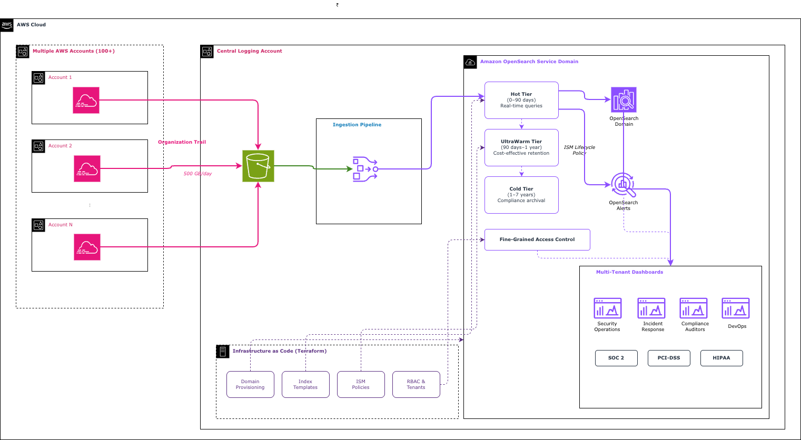

# Centralized CloudTrail Monitoring with Amazon OpenSearch Service and Terraform

This repository contains the companion code for the AWS Big Data Blog post: [How a Financial Services Company Centralized Security Monitoring Across 100+ AWS Accounts](https://aws.amazon.com/blogs/big-data/).

It deploys a centralized AWS CloudTrail monitoring solution using Amazon OpenSearch Service and demonstrates **reusable, modular Terraform** - each module is independently sourceable, composable, and saves significant lines of code when adopted across multiple environments or use cases.

## Architecture

The solution ingests AWS CloudTrail logs from 100+ AWS accounts through the following pipeline:



Key features:
- **Centralized ingestion** from 100+ AWS accounts via organization trail
- **Auto-scaling pipeline** from Amazon S3 through Amazon SQS to Amazon OpenSearch Ingestion
- **500 GB/day** ingestion capacity with auto-scaling (2-10 OCUs)
- **7-year retention** with tiered storage (hot -> warm -> cold -> delete)
- **4 team roles** with fine-grained access control and tenant isolation
- **Automated alerting** for AWS CloudTrail tampering events
- **Full Terraform management** of infrastructure and application-layer config

## Module Architecture

The stack is decomposed into 5 reusable modules that communicate through explicit outputs:

```
+-----------------------------------------------------------------------------+
|  Root Module (main.tf)                                                      |
|  - Composes modules, passes outputs between them, configures providers      |
+-----------------------------------------------------------------------------+
|                                                                             |
|  +---------------------+      +----------------------------------------+   |
|  |  opensearch-domain   |----->|  ingestion                             |   |
|  |  ------------------- |      |  ---------------------------------     |   |
|  |  * Domain + cluster  |      |  * SQS queues (main + DLQ)            |   |
|  |  * KMS encryption    |      |  * S3 event notifications             |   |
|  |  * Security groups   |      |  * OSIS pipeline + IAM                |   |
|  |  * CloudWatch logs   |      |  * Pipeline security group            |   |
|  |  * Admin IAM role    |      +----------------------------------------+   |
|  +----------+-----------+                                                   |
|             | endpoint, admin_role_arn (configures opensearch provider)      |
|             v                                                               |
|  +---------------------+  +------------------+  +----------------------+   |
|  |  index-lifecycle     |  |  access-control  |  |  alerting            |   |
|  |  ------------------- |  |  --------------  |  |  ----------------    |   |
|  |  * Index template    |  |  * Team roles    |  |  * SNS + KMS         |   |
|  |  * ISM policy        |  |  * Role mappings |  |  * Tampering monitor |   |
|  |  * Bootstrap index   |  |  * Tenants       |  |  * Notification ch.  |   |
|  +---------------------+  +------------------+  +----------------------+   |
|          ^                        ^                       ^                  |
|          +------------------------+-----------------------+                  |
|                    All use the opensearch provider                           |
+-----------------------------------------------------------------------------+
```

### Why Modules?

| Benefit | Example |
|---------|---------|
| **Reuse across environments** | Same `opensearch-domain` module for dev, staging, production - just change variables |
| **Compose only what you need** | Need ingestion without alerting? Skip the `alerting` module |
| **Adapt to new use cases** | VPC Flow Logs -> reuse `ingestion` + `index-lifecycle` with different index patterns |
| **Team autonomy** | Security team owns `alerting` module; platform team owns `opensearch-domain` |
| **Fewer lines of code** | One module call replaces 50-100 lines of resource definitions per environment |

## File Structure

```
.
├── README.md                        # This file
├── LICENSE
├── CONTRIBUTING.md
├── CODE_OF_CONDUCT.md
├── .gitignore
├── main.tf                          # Root module - calls child modules
├── variables.tf                     # Root-level inputs (3 required + overrides)
├── outputs.tf                       # Root-level outputs (aggregated from modules)
├── providers.tf                     # AWS + OpenSearch provider config
├── versions.tf                      # Terraform and provider version constraints
├── terraform.tfvars.example         # Example values
├── images/
│   └── architecture.png             # Solution architecture diagram
├── modules/
│   ├── opensearch-domain/           # Core domain + KMS + security groups + CloudWatch
│   │   ├── main.tf
│   │   ├── variables.tf
│   │   ├── outputs.tf
│   │   └── iam.tf
│   ├── ingestion/                   # SQS + S3 notification + OSIS pipeline + IAM
│   │   ├── main.tf
│   │   ├── variables.tf
│   │   └── outputs.tf
│   ├── index-lifecycle/             # Index template + ISM policy + initial index
│   │   ├── main.tf
│   │   ├── variables.tf
│   │   └── outputs.tf
│   ├── access-control/              # Roles + role mappings + tenants
│   │   ├── main.tf
│   │   ├── variables.tf
│   │   └── outputs.tf
│   └── alerting/                    # SNS + monitors + notification channels
│       ├── main.tf
│       ├── variables.tf
│       └── outputs.tf
```

## Quick Start

You only need **3 inputs** to deploy:

```hcl
vpc_id                    = "vpc-0abc123def456789a"
vpc_subnet_ids            = ["subnet-aaaa1111bbbb2222c", "subnet-dddd3333eeee4444f", "subnet-ffff5555aaaa6666b"]
cloudtrail_s3_bucket_name = "amzn-s3-demo-bucket-cloudtrail-logs"
```

The modules automatically create:
- AWS IAM admin role for Amazon OpenSearch Service admin user
- Amazon SNS topic for security alerts
- Amazon SQS queues (main + DLQ) for ingestion throttling
- Security groups with least-privilege rules
- OSIS pipeline IAM role
- AWS KMS key for encryption at rest

> **Cost warning:** This solution deploys billable AWS resources including Amazon OpenSearch Service instances (or1.2xlarge), Amazon EBS gp3 volumes, and Amazon OpenSearch Ingestion OCUs. Review the [Amazon OpenSearch Service pricing](https://aws.amazon.com/opensearch-service/pricing/) before deploying. Remember to clean up resources when they are no longer needed to avoid ongoing charges.

## Prerequisites

- AWS account with AWS CloudTrail organization trail configured
- Terraform >= 1.5.0
- AWS CLI configured with appropriate permissions
- Amazon VPC with private subnets (at least 2 for multi-AZ, 3 recommended)
- An existing Amazon S3 bucket where AWS CloudTrail logs are delivered

## Usage

1. **Clone the repository:**
   ```bash
   git clone https://github.com/aws-samples/sample-cloudtrail-opensearch-terraform.git
   cd sample-cloudtrail-opensearch-terraform
   ```

2. **Create your variables file:**
   ```bash
   cp terraform.tfvars.example terraform.tfvars
   ```

3. **Edit terraform.tfvars** with your 3 required values (Amazon VPC ID, subnet IDs, and Amazon S3 bucket name).

4. **Initialize Terraform:**
   ```bash
   terraform init
   ```

5. **Deploy Stage 1 - the OpenSearch domain** (required before the OpenSearch provider can connect):
   ```bash
   terraform apply -target=module.opensearch_domain
   ```

6. **Deploy Stage 2 - everything else** (ingestion, index lifecycle, access control, alerting):
   ```bash
   terraform apply
   ```

7. **Verify the deployment:**
   ```bash
   terraform output
   aws opensearch describe-domain --domain-name cloudtrail-monitoring --query 'DomainStatus.Processing'
   echo "Dashboards URL: https://$(terraform output -raw opensearch_dashboards_endpoint)/_dashboards"
   ```

### Two-Stage Apply Pattern

The OpenSearch provider requires the domain endpoint and admin IAM role to authenticate. Since these are created by the `opensearch-domain` module, Terraform cannot configure the provider until that module's resources exist. The two-stage apply solves this:

| Stage | What it creates | Why separate |
|-------|-----------------|--------------|
| Stage 1 | OpenSearch domain, KMS, security groups, IAM admin role, CloudWatch | Provider needs the endpoint |
| Stage 2 | Index template, ISM policy, RBAC roles, ingestion pipeline, alerting | Requires working OpenSearch provider |

After the initial two-stage deploy, subsequent `terraform apply` runs work in a single pass because the domain already exists.

## Using Individual Modules

Each module can be sourced independently in other Terraform configurations:

```hcl
# Example: Reuse the ingestion module for VPC Flow Logs
module "vpc_flow_ingestion" {
  source = "git::https://github.com/aws-samples/sample-cloudtrail-opensearch-terraform.git//modules/ingestion"

  domain_name                  = "vpc-flow-monitoring"
  vpc_id                       = var.vpc_id
  vpc_subnet_ids               = var.vpc_subnet_ids
  cloudtrail_s3_bucket_name    = var.flow_logs_bucket_name
  opensearch_domain_arn        = module.opensearch_domain.arn
  opensearch_domain_endpoint   = module.opensearch_domain.endpoint
  opensearch_security_group_id = module.opensearch_domain.security_group_id
}

# Example: Reuse index-lifecycle with different retention
module "vpc_flow_lifecycle" {
  source = "git::https://github.com/aws-samples/sample-cloudtrail-opensearch-terraform.git//modules/index-lifecycle"

  hot_retention_days  = 30
  warm_retention_days = 90
  cold_retention_days = 365
}
```

## Required Inputs

| Variable | Description |
|----------|-------------|
| `vpc_id` | Amazon VPC ID for the Amazon OpenSearch Service domain |
| `vpc_subnet_ids` | List of subnet IDs (min 2, one per AZ) |
| `cloudtrail_s3_bucket_name` | Name of existing Amazon S3 bucket with AWS CloudTrail logs |

## Optional Inputs

| Variable | Default | Description |
|----------|---------|-------------|
| `aws_region` | `us-east-1` | AWS Region |
| `environment` | `production` | Deployment environment |
| `domain_name` | `cloudtrail-monitoring` | Amazon OpenSearch Service domain name |
| `instance_type` | `or1.2xlarge.search` | Node instance type |
| `instance_count` | `3` | Number of data nodes |
| `ebs_volume_size` | `500` | Storage per node (GB) |
| `osis_min_units` | `2` | Min OCUs for ingestion |
| `osis_max_units` | `10` | Max OCUs for ingestion |
| `alert_email_endpoint` | `""` | Email for alert notifications |
| `team_role_arns` | `{}` | Map of team to AWS IAM role ARNs |
| `hot_retention_days` | `90` | Days in hot storage |
| `warm_retention_days` | `365` | Days in warm storage |
| `cold_retention_days` | `2555` | Total days before deletion |

## Outputs

| Output | Description |
|--------|-------------|
| `opensearch_domain_endpoint` | Domain endpoint URL |
| `opensearch_dashboards_endpoint` | Dashboards URL |
| `admin_iam_role_arn` | Created admin IAM role ARN |
| `sns_topic_arn` | Created Amazon SNS topic ARN |
| `sqs_queue_url` | Ingestion Amazon SQS queue URL |
| `osis_pipeline_arn` | Ingestion pipeline ARN |
| `opensearch_role_names` | Map of created team role names |
| `kms_key_arn` | AWS KMS key ARN for encryption at rest |

## Customization

### Adding a new team role

1. Add the role definition to `local.team_roles` in `modules/access-control/main.tf`.
2. Add the AWS IAM role ARN to `var.team_role_arns` in your tfvars.
3. Run `terraform apply`.

### Adjusting retention periods

Modify these variables in your tfvars:
- `hot_retention_days` (default: 90)
- `warm_retention_days` (default: 365)
- `cold_retention_days` (default: 2555 / ~7 years)

### Scaling the ingestion pipeline

Adjust `osis_min_units` and `osis_max_units`. Each OCU supports approximately 1.5-2 MB/s of ingestion throughput. Maximum is 96 OCUs per pipeline.

### Receiving alert notifications

Set `alert_email_endpoint` to your security team's email:
```hcl
alert_email_endpoint = "security-team@example.com"
```

## Cleanup

> **Warning:** This operation permanently deletes all AWS CloudTrail logs stored in the Amazon OpenSearch Service domain, including up to 7 years of retention data. Verify that you have exported or backed up any data you need to retain before proceeding.

To destroy all resources:

1. Remove lifecycle protection by commenting out the `prevent_destroy` block in `modules/opensearch-domain/main.tf`:
   ```hcl
   # lifecycle {
   #   prevent_destroy = true
   # }
   ```

2. Run the destroy command:
   ```bash
   terraform destroy
   ```

This removes the following resources: Amazon OpenSearch Service domain (including Amazon EBS volumes), Amazon OpenSearch Ingestion pipeline, AWS IAM roles and policies, Amazon SQS queues (main and DLQ), Amazon SNS topic, Amazon S3 event notifications, AWS KMS key, Amazon CloudWatch log groups, and security groups.

## Security Considerations

- All data is encrypted at rest using a customer-managed AWS KMS key and in transit (TLS 1.2+)
- Fine-grained access control helps enforce least-privilege per team
- The Amazon OpenSearch Service domain is deployed in an Amazon VPC (no public access)
- Amazon SQS queues use server-side encryption
- Amazon SNS topic uses AWS KMS encryption
- AWS IAM roles follow the principle of least privilege
- AWS CloudTrail tampering is monitored with automated alerts
- Audit logs are published to Amazon CloudWatch Logs with 365-day retention

## Related Resources

- [Amazon OpenSearch Service documentation](https://docs.aws.amazon.com/opensearch-service/latest/developerguide/)
- [Terraform OpenSearch provider documentation](https://registry.terraform.io/providers/opensearch-project/opensearch/latest/docs)
- [Amazon OpenSearch Ingestion documentation](https://docs.aws.amazon.com/opensearch-service/latest/developerguide/ingestion.html)
- [AWS CloudTrail documentation](https://docs.aws.amazon.com/cloudtrail/latest/userguide/)

## Authors

- Jagdish Komakula, AWS Professional Services
- Aditya Ambati, AWS Professional Services

## License

This library is licensed under the MIT-0 License. See the [LICENSE](LICENSE) file.
